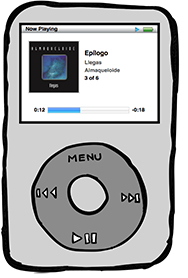

# iPodJS



A Javascript iPod with no dependencies, have fun with it!

## Demo

See the iPod in action here: http://demos.duhnnie.net/ipod/

## Usage

### Requirements

Either for running the demo on your machine or generate the distributable files (for use iPodJS on your own project) you will need:

  * A modern mobile/desktop web browser. iPodJS also runs on older browsers, but in some cases it will be necessary some polyfills (the ones that were excluded from the project in order to keep the code clean). More info in the [Compatibility](#compatibility) and [Known Issues](#known-issues) sections below.

  * Node.JS and NPM must be installed on the machine that will build the demo (or the distributable files).

### Installation

1. Clone the repo.
2. Change to the repo directory and run `npm install`.

### Running the development demo

Once the repo is installed, inside the repo directory run `npm run start`. A browser will be open with an iPod on a HTML page.

### Using iPodJS in another project

To use the iPod in your project you will need to build the distributable file, for that, once the repo is installed run `npm run build`, all necessary files will be output in the `dist` directory.

There are some issues in some browsers due the lack of some browser ES6 implemented functions (like Array.from()). For more info about it read the [Compatibility](#compatibility) and [Known Issues](#known-issues) sections below.

Usage Example:

```html
<!DOCTYPE html>
<html lang="en">
  <head>
    <meta charset="utf-8"/>
    <link rel="stylesheet" href="css/ipodjs.css"/>
    <script src="js/ipod.js"></script>
    <script>
      document.addEventListener('DOMContentLoaded', () => {

        const ipod = iPodJS.create({
          skipTrackOnError: true,
          timeBeforeSkip: 5000,
          playlists: [
            {
              name: "Playlist #1",
              tracks: [
                {
                  artist: "Autolux",
                  title: "Change My Head",
                  album: "PUSSY'S DEAD",
                  artwork: "img/autolux.jpg",
                  audio: "audio/change_my_head.mp3"
                },
                {
                  artist: "Grouplove",
                  title: "Borderlines and Aliens",
                  album: "Spreading Rumors",
                  artwork: "img/grouplove.jpg",
                  audio: "audio/borderlines.mp3"
                }
              ]
            },
            {
              name: "Playlist #2",
              tracks: [
                {
                  artist: "NOFX",
                  title: "Linoleum",
                  album: "Punk in Drublic",
                  artwork: "img/nofx.jpg",
                  audio: "audio/linoleum.mp3"
                },
                {
                  artist: "Radiohead",
                  title: "Airbag",
                  album: "OK Computer",
                  artwork: "img/radiohead.jpg",
                  audio: "audio/airbag.mp3"
                }
              ]
            }
          ]
        });

        document.body.appendChild(ipod.getHTML());
      });
    </script>
    <title>My iPod</title>
  </head>
  <body></body>
</html>
```
  
## Compatibility

Since iPodJS is built using Babel, it is compatible with modern browsers and older ones. However, to keep the project code clean, some browser-core function polyfills were not included on the distributable files. So, in production polyfills for some unimplemented browser functions must be applied (Babel).

## Known issues

For Microsoft IE11/Edge it is necessary to apply some polyfills to solve some issues:
  * Edge doesn't have a promise-like implementation of the `Audio.play()` method. A dirty polyfill is being used *ONLY* for the demo using the `npm run start` command. For production the polyfill must be applied manually or by using some tool (Babel), since the distribuitable code doesn't include the browser-function polyfills.

  ```js 
  // This is a polyfill to allow a good demo in IE/non-Chromium Edge, since they not have a promise-like implementation
  //on Audio object, in production use some pollyfill package. Different versions for this polyfill can be used.
  Audio.prototype.play =  (function () {
      const originalFn = Audio.prototype.play;

      return function () {
          let resp,
              error;

          try {
              resp = originalFn.apply(this, arguments);
          } catch (e) {
              error = true;
          }
          
          if (resp && resp.catch) {
              return resp;
          } else {
              return {
                  catch: function (fn) {
                      if (error) {
                          fn(error || {});    
                      }
                  }
              };
          }
      };
  }) ();
  ```

  * IE11 has issues with `Array.from()` method, it needs to be polyfilled to make the iPodJS work.

## Become a contribuitor
  
Any suggestion, or idea of improvement just fork the repo and send the PR.

**Happy listening!**
